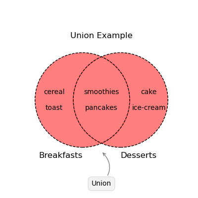
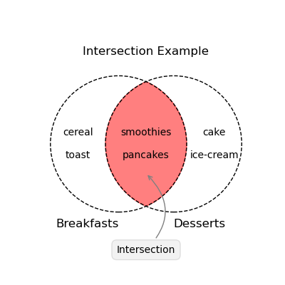
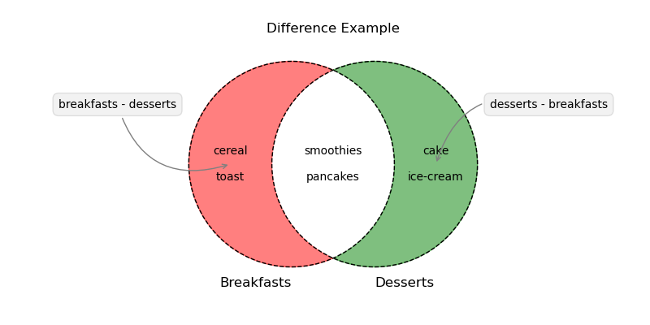

# Sets in Python

At its core, a **set** is an unordered collection of unique elements. Like a list, a set allows you to store multiple elements in a single variable. However, unlike a list, a set **does not maintain the order** of its elements, and it **does not allow duplicates**.

The following highlights the key differences between a list and a set:

::::: box {.flexbox} |

:::: box {#list-column} |

### **List**

An empty list is defined using square brackets `[]`.

```python
empty_list = []
```

The square brackets can also be used to define a list with elements.

```python
list_of_numbers = [2, 5, 4, 3, 1]
```

A list is **ordered**, so the elements are stored in the order they were added.

```python
list_of_numbers
```

```plaintext {.output}
[2, 5, 4, 3, 1]
```

Appending (or inserting) duplicate elements is possible.

```python
list_of_numbers.append(2)
list_of_numbers
```

```plaintext {.output}
[2, 5, 4, 3, 1, 2]
```

The `==` operator checks if two lists have the same elements in the same order.

```python
[1, 2, 3, 4, 5] == [1, 2, 3, 4, 5]
```

```plaintext {.output}
True
```

```python
[2, 5, 4, 3, 1] == [1, 2, 3, 4, 5]
```

```plaintext {.output}
False
```

::::

:::: box {#set-column} |

### **Set**

An empty set is defined using the `set()` function.

```python
empty_set = set()
```

However, a set with elements is defined using curly braces `{}`.

```python
set_of_numbers = {2, 5, 4, 3, 1}
```

A set is **unordered**, so the elements are not stored in the order they were added.

```python
set_of_numbers
```

```plaintext {.output}
{1, 2, 3, 4, 5}
```

Duplicate entries are automatically removed - even if you try to add them.

```python
set_of_numbers.add(2)
set_of_numbers
```

```plaintext {.output}
{1, 2, 3, 4, 5}
```

The `==` operator only checks if two sets have the same elements, regardless of order.

```python
{1, 2, 3, 4, 5} == {1, 2, 3, 4, 5}
```

```plaintext {.output}
True
```

```python
{2, 5, 4, 3, 1, 5, 4, 3, 1, 2} == {1, 2, 3, 4, 5}
```

```plaintext {.output}
True
```

::::

:::::

# Set Operations

Sets support a variety of operations that can be used to manipulate and compare sets. Let's say we have two sets - `breakfasts` and `desserts`:

```python
breakfasts = {'cereal', 'toast', 'pancakes', 'smoothies'}
desserts = {'pancakes', 'ice-cream', 'cake', 'smoothies'}
```

The following tabs demonstrate some of the operations that can be performed on sets:

::::: tabs

<!-- no toc -->
- [Union](#union)
- [Intersection](#intersection)
- [Difference](#difference)
- [Membership](#membership)
- [List to Set](#list-to-set)

:::: tab-content | union

### Union

The union of two sets contains all the elements from both sets. 

The `|` operator can be used to find the union of two sets.

```python
breakfasts | desserts
```

```plaintext {.output}
{'cake', 'cereal', 'ice-cream', 'pancakes', 'smoothies', 'toast'}
```

The following Venn diagram illustrates the union of two sets:



::::

:::: tab-content | intersection

### Intersection

The intersection of two sets contains only the elements that are common to both sets. 

The `&` operator can be used to find the intersection of two sets.

```python
breakfasts & desserts
```

```plaintext {.output}
{'pancakes', 'smoothies'}
```

The following Venn diagram illustrates the intersection of two sets:



::::

:::: tab-content | difference

### Difference

The difference between two sets contains the elements that are **in the first set** but **not in the second set**.

The `-` operator can be used to find the difference between two sets.

```python
breakfasts - desserts
```

```plaintext {.output}
{'cereal', 'toast'}
```

The above shows the elements that are in `breakfasts` but not in `desserts`. But it can also be the other way around.

```python
desserts - breakfasts
```

```plaintext {.output}
{'cake', 'ice-cream'}
```

The following Venn diagram illustrates the difference between two sets:



::::

:::: tab-content | membership

### Membership

You can check if an element is present in a set using the `in` operator.

```python
'cereal' in breakfasts
```

```plaintext {.output}
True
```

```python
'cereal' in desserts
```

```plaintext {.output}
False
```

::::

:::: tab-content | list-to-set

### List to Set

You can convert a list to a set using the `set()` function.

```python
list_of_numbers = [2, 5, 4, 3, 1]
set_of_numbers = set(list_of_numbers)
set_of_numbers
```

```plaintext {.output}
{1, 2, 3, 4, 5}
```

::::

:::::

# Video Recap

Watch the video below for a recap and demonstration of the above concepts.

<p><iframe style="width: 1126px; height: 915px;" title="Sets" src="https://canvas.qut.edu.au/courses/17088/external_tools/retrieve?display=borderless&amp;resource_link_lookup_uuid=4ff57149-2018-4a0d-8492-41ecddf48f72" allowfullscreen="allowfullscreen" allow="geolocation *; microphone *; camera *; midi *; encrypted-media *; autoplay *; clipboard-write *; display-capture *"></iframe></p>
